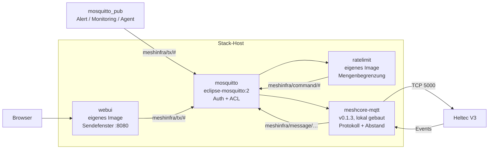
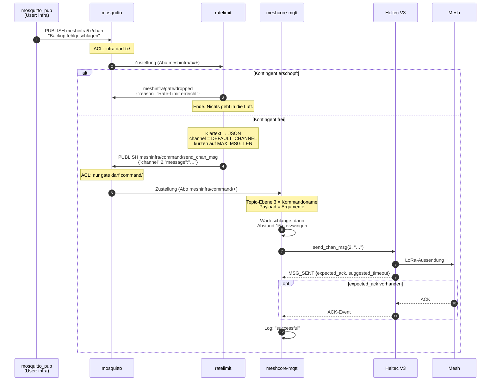
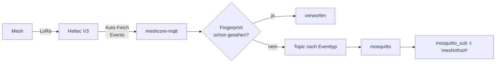

# meshinfra — Architektur

Wie eine Zeile `mosquitto_pub` zu einem Funkpaket auf 868 MHz wird, und was
unterwegs alles passieren kann.

Bedienung und Troubleshooting stehen im [README](README.md). Dieses Dokument
erklärt den Aufbau: welche Teile es gibt, warum sie so geschnitten sind, was
sie garantieren — und was nicht.

Alle Zeilenangaben beziehen sich auf `ipnet-mesh/meshcore-mqtt` **v0.1.3**.

---

## 1. Der große Aufbau

Ein Funkgerät, zwei Hosts, zwei völlig unabhängige Softwarestapel.

```
   Observer-Host                     Stack-Host
   =============                     ==========

                                     Einlieferung
                                     ├─ mosquitto_pub   (Skript, Cron, Agent)
                                     └─ Sendefenster    (Browser, Port 8080)
                                              │
   meshcore-packet-capture                    │ meshinfra/tx/#
   (Observer, hört nur zu)                    ▼
        │                          ┌────────────────────────────────┐
        │ MQTT                     │  mosquitto  —  Auth + ACL      │
        ▼                          └────────────────────────────────┘
   mosquitto ──► carinthiamesh          │   ▲                 │
   (Prefix meshcore/…)                  │   │                 │
        ▲                        tx/#   │   │ command/#       │ command/#
        │                               ▼   │                 ▼
        │                          ratelimit ┘          meshcore-mqtt
        │                          (Menge pro Stunde)   (Abstand 15 s)
        │                                                     │
        │ TCP 5000                                            │ TCP 5000
        └──────────────────────┬──────────────────────────────┘
                               ▼
                     ┌────────────────────┐
                     │     Heltec V3      │  Companion Radio,
                     │  Companion TCP     │  trägt mehrere Clients
                     └─────────┬──────────┘
                               │ LoRa 868 MHz
                               ▼
                          ~~~ Mesh ~~~
```

Die beiden Stapel wissen nichts voneinander. Sie teilen sich genau eine
Ressource: den Node. Getrennt sind Host, Broker, Topic-Prefix und Zweck.

| | Observer-Host | Stack-Host |
|---|---|---|
| Software | `meshcore-packet-capture` | `meshcore-mqtt` + Gate |
| Richtung | nur empfangen | senden **und** empfangen |
| Prefix | `meshcore/…` | `meshinfra/…` |
| Broker | eigener, mit Upstream zu carinthiamesh | eigener, LAN-intern, kein Upstream |
| Zweck | Netzbeobachtung, Kartendaten | Meldungen aus der IT-Infrastruktur |

### Warum zwei Stapel und nicht einer

Der Observer ist ein fremdes Projekt mit eigenem Lebenszyklus. Ihn um eine
Senderichtung zu erweitern hieße, ihn zu forken und bei jedem Upstream-Update
nachzuziehen. Ein zweiter Client kostet stattdessen ~10 MB Broker und eine
TCP-Verbindung — und der Observer bleibt aktualisierbar, wie er ist.

Die Grundannahme dahinter — **der Companion trägt mehrere gleichzeitige
TCP-Clients** — war die erste Sache, die verifiziert wurde. Siehe
[Abschnitt 8](#8-was-nachgewiesen-ist).

---

## 2. Die fünf Bausteine



| Baustein | Aufgabe | Zustand |
|---|---|---|
| `mosquitto` | Transport, Authentifizierung, **Rechtetrennung** | persistent (Volume) |
| `webui` | Sendefenster von Hand: Formular, Zeichenzähler, Kontingentanzeige | zustandslos |
| `ratelimit` | **Menge** pro Stunde deckeln, verwerfen, protokollieren | flüchtig, im RAM |
| `meshcore-mqtt` | Companion-Protokoll, **Abstand** zwischen Sendungen, Retry, Empfang | flüchtig |
| Heltec V3 | Funk | persistent (Kanäle, Kontakte) |

Zwei Bausteine bremsen, und sie bremsen **verschiedene Größen**. Das ist der
Kern des Entwurfs, siehe [Abschnitt 5](#5-die-zwei-bremsen).

---

## 3. Der Sendeweg im Detail



### Was die Ebenen aus dem Topic machen

`meshcore-mqtt` abonniert genau ein Muster: `{prefix}/command/+`
([`mqtt_worker.py:682`](https://github.com/ipnet-mesh/meshcore-mqtt/blob/v0.1.3/meshcore_mqtt/mqtt_worker.py#L682)).
Beim Eintreffen zerlegt es das Topic an den Schrägstrichen und prüft
**`topic_parts[1] == "command"`**
([`mqtt_worker.py:724`](https://github.com/ipnet-mesh/meshcore-mqtt/blob/v0.1.3/meshcore_mqtt/mqtt_worker.py#L724)):

```
meshinfra / command / send_chan_msg
   [0]        [1]          [2]
    │          │            │
    │          │            └── Kommandoname
    │          └── muss wörtlich "command" sein
    └── Prefix — deshalb MUSS er einstufig sein
```

Ein Prefix wie `mesh/infra` würde `topic_parts[1]` auf `"infra"` schieben und
**jedes Kommando still verschlucken**. Kein Fehler, keine Meldung.

Die Payload wird nur dann als JSON gelesen, wenn sie mit `{` beginnt; sonst
wird sie zu `{"data": "<text>"}`
([`mqtt_worker.py:740-743`](https://github.com/ipnet-mesh/meshcore-mqtt/blob/v0.1.3/meshcore_mqtt/mqtt_worker.py#L740-L743))
— für `send_chan_msg` unbrauchbar, weil `channel` fehlt. Genau deshalb baut das
Gate immer vollständiges JSON, auch wenn du Klartext einlieferst. Der Komfort
liegt im Gate, nicht in der Bridge.

### Vollständige Kommandoliste

Aus dem aktiven Codepfad `bridge_coordinator` → `meshcore_worker`
([`meshcore_worker.py:345-424`](https://github.com/ipnet-mesh/meshcore-mqtt/blob/v0.1.3/meshcore_mqtt/meshcore_worker.py#L345-L424)):

| Kommando | Payload | Pflicht |
|---|---|---|
| `send_chan_msg` | `{"channel": 2, "message": "…"}` | `channel` int, `message` str |
| `send_msg` | `{"destination": "Name", "message": "…"}` | beide str |
| `send_advert` | `{"flood": false}` | — |
| `send_trace` | `{}` | — |
| `send_telemetry_req` | `{"destination": "Name"}` | `destination` |
| `send_login` | `{"destination": "…", "password": "…"}` | beide |
| `send_logoff` | `{"destination": "Name"}` | `destination` |
| `device_query` | `{}` | — |
| `get_battery` | `{}` | — |
| `set_name` | `{"name": "…"}` | `name` str |

> Das Upstream-README nennt zusätzlich `ping`. Im aktiven Pfad existiert es
> nicht — nur im nicht mehr verdrahteten `meshcore_client.py`. Umgekehrt fehlen
> dort `send_login` und `send_logoff`. **Quellcode schlägt Doku.**

**Kanäle lassen sich über MQTT weder abfragen noch setzen.** Das Event
`CHANNEL_INFO` wird abonniert, ein Kommando dazu gibt es nicht. Dafür direkt die
Bibliothek benutzen, siehe README.

---

## 4. Der Empfangsweg

Die Gegenrichtung läuft mit, weil dasselbe Werkzeug beides kann.



`meshcore-mqtt` abonniert am Node standardmäßig neun Eventtypen
([`config.py:82-93`](https://github.com/ipnet-mesh/meshcore-mqtt/blob/v0.1.3/meshcore_mqtt/config.py#L82-L93)):
`CONTACT_MSG_RECV`, `CHANNEL_MSG_RECV`, `DEVICE_INFO`, `BATTERY`,
`NEW_CONTACT`, `ADVERTISEMENT`, `TRACE_DATA`, `TELEMETRY_RESPONSE`,
`CHANNEL_INFO` — dazu `NO_MORE_MSGS` für die Auto-Fetch-Steuerung und `ACK`
für die Sendebestätigung.

Jedes Event bekommt einen Fingerabdruck aus Typ und Inhalt
([`meshcore_worker.py:896`](https://github.com/ipnet-mesh/meshcore-mqtt/blob/v0.1.3/meshcore_mqtt/meshcore_worker.py#L896));
Wiederholungen werden verworfen
([`:1005-1010`](https://github.com/ipnet-mesh/meshcore-mqtt/blob/v0.1.3/meshcore_mqtt/meshcore_worker.py#L1005-L1010)).
Im Mesh hört man dasselbe Paket über mehrere Repeater — ohne Dedup stünde
jede Nachricht mehrfach im Broker.

### Topic-Karte

```
meshinfra/
├── tx/                      ← DU schreibst hierhin
│   ├── chan                    Klartext oder {"channel":N,"message":"…"}
│   └── direct                  {"destination":"…","message":"…"}
│
├── gate/                    ← das Gate meldet
│   ├── status                  online | offline        (retained, LWT)
│   ├── quota                   {"limit","used","remaining"}  (retained)
│   └── dropped                 pro verworfener Nachricht
│
├── command/                 ← nur das Gate schreibt (ACL)
│   ├── send_chan_msg
│   ├── send_msg
│   └── … (siehe Tabelle oben)
│
├── status                   ← Verbindung zum Node    (retained)
├── message/
│   ├── channel/<idx>           empfangene Kanalnachricht
│   └── direct/<pubkey_prefix>  empfangene Direktnachricht
├── events/connection
├── advertisement, new_contact, contacts, self_info
├── battery, device_info, telemetry, channel_info, login
└── traceroute/<tag>
```

`<pubkey_prefix>` ist das 6-Byte-Präfix des **Absender**-Schlüssels, hex.
Zum Adressieren taugt es nicht — dort erwartet `destination` einen
Kontaktnamen oder eine Node-ID als String.

---

## 5. Die zwei Bremsen

Der häufigste Denkfehler: „es gibt doch schon ein Rate Limit". Es gibt zwei,
und sie tun Verschiedenes.

```
        Menge                              Abstand
   ┌──────────────┐                  ┌──────────────────┐
   │  ratelimit   │                  │  meshcore-mqtt   │
   │              │                  │                  │
   │  12 pro      │                  │  15 s zwischen   │
   │  rollender   │                  │  zwei Sendungen  │
   │  Stunde      │                  │                  │
   │              │                  │  = max 240/h     │
   │  Überschuss  │                  │  Überschuss      │
   │  → verworfen │                  │  → wartet        │
   └──────────────┘                  └──────────────────┘
        ▲                                     ▲
        │ deckelt, was in die Luft darf       │ verhindert Bursts
```

Die eingebauten Delays
([`config.py:117-127`](https://github.com/ipnet-mesh/meshcore-mqtt/blob/v0.1.3/meshcore_mqtt/config.py#L117-L127),
je 15.0 s) entzerren nur. Ein Alert-Sturm von 500 Nachrichten läuft dort
vollständig durch — er dauert bloß zwei Stunden. Für ein SRD-Band mit
Sendezeitbegrenzung ist das keine Bremse, sondern eine Verzögerung.

Das Gate deckelt die **Menge** und **verwirft** den Überschuss, statt ihn zu
puffern. Bewusst: eine Warteschlange würde Alerts von vor drei Stunden
verspätet ausliefern, was schlimmer ist als sie zu verlieren.

### Airtime-Budget

Ein Kanalpaket ist bis `MAX_MSG_LEN` = 140 Zeichen lang. Entscheidend ist
aber, dass **eine Nachricht mehrere Aussendungen bedeuten kann**:

```
Nachricht → Versuch 1 → kein ACK → Versuch 2 → … → Versuch 4
            (1 Sendung)            (1 Sendung)      (1 Sendung)
```

`message_retry_count` ist 3, also bis zu **4 Aussendungen pro Nachricht**
([`meshcore_worker.py:1145`](https://github.com/ipnet-mesh/meshcore-mqtt/blob/v0.1.3/meshcore_mqtt/meshcore_worker.py#L1145)).
Bei `RATE_LIMIT_PER_HOUR=12` liegt die Obergrenze also bei **48 Aussendungen
pro Stunde**, nicht bei 12. Wer das Limit hochsetzt, muss mit diesem Faktor
rechnen.

Zeitlicher Verlauf im schlechtesten Fall für eine einzige Nachricht:

| Schritt | Wartezeit | kumuliert |
|---|---|---|
| Initial Delay vor der ersten Sendung | 15 s | 15 s |
| ACK-Fenster (`suggested_timeout`, Vorgabe 7000 ms) | 7 s | 22 s |
| Backoff `2.0 × 2⁰` | 2 s | 24 s |
| Abstand + ACK + Backoff `2.0 × 2¹` | ~26 s | ~50 s |
| Abstand + ACK + Backoff `2.0 × 2²` | ~30 s | ~80 s |
| Abstand + ACK (letzter Versuch) | ~22 s | **~100 s** |

Eine fehlschlagende Nachricht blockiert die Warteschlange also bis zu anderthalb
Minuten. Für Alerts einkalkulieren: die Bridge ist kein Echtzeitkanal.

> `reset_path_on_failure` (Vorgabe an) greift **nur bei Direktnachrichten**
> ([`meshcore_worker.py:1057`](https://github.com/ipnet-mesh/meshcore-mqtt/blob/v0.1.3/meshcore_mqtt/meshcore_worker.py#L1057)),
> nicht bei Kanalnachrichten. Kanalnachrichten fluten ohnehin.

---

## 6. Das Rechtemodell

Ein Rate Limit, das man umgehen kann, ist kein Rate Limit. Deshalb trennt der
Broker Einlieferung von Ausführung — nicht durch Konvention, sondern durch ACL.

```
                      ┌─────────────────────────────────────┐
                      │           mosquitto ACL             │
                      └─────────────────────────────────────┘

   User: infra              User: gate               User: bridge
   (mosquitto_pub
    UND webui)
   ───────────              ──────────               ────────────
   W  meshinfra/tx/#        R  meshinfra/tx/#        R  meshinfra/command/#
   R  meshinfra/#           W  meshinfra/command/#   W  meshinfra/#
   R  $SYS/broker/uptime    RW meshinfra/gate/#

        │                        │    ▲                    │
        │ darf einliefern        │    │ darf ausführen     │ darf melden
        ▼                        ▼    │                    ▼
   ╔═════════╗            ╔══════════╗│              ╔═══════════╗
   ║ tx/#    ║───────────►║ Gate     ║┘              ║ command/# ║
   ╚═════════╝            ╚══════════╝──────────────►╚═══════════╝
                                │
                          hier und nur hier
                          greift die Mengenbegrenzung
```

Ein Publish von `infra` direkt auf `meshinfra/command/send_chan_msg` wird vom
Broker **stillschweigend verworfen**. `mosquitto_pub` meldet trotzdem Erfolg —
MQTT kennt für abgelehnte Publishes keine Rückmeldung an den Absender. Das ist
die unangenehmste Eigenschaft dieses Entwurfs und der Grund, warum es als
erster Eintrag in der Troubleshooting-Tabelle steht.

Deshalb drei Konten statt einem. Ein einziges Konto hätte bedeutet: jeder, der
publizieren darf, darf auch am Gate vorbei.

**Das Sendefenster bekommt kein eigenes Konto.** Es benutzt `infra`, genau wie
ein `mosquitto_pub` von Hand, und hat damit exakt dieselben Rechte: schreiben
nur auf `meshinfra/tx/#`. Ein Formular im Browser ist für die ACL kein
Sonderfall — es ist nur ein weiterer Einlieferer. Damit gilt die
Mengenbegrenzung auch dort, ohne dass irgendwo eine zweite Prüfung nötig wäre.

Mosquitto 2 kennt **keine Deny-Regeln**. Was nicht in der ACL steht, ist
verboten. Der Prefix ist dort fest verdrahtet, weil Mosquitto keine Variablen
interpoliert — `MQTT_PREFIX` in `.env` zu ändern, ohne die ACL nachzuziehen,
legt den ganzen Stapel still, ohne eine einzige Fehlermeldung.

---

## 7. Zustand, Neustart und was schiefgehen kann

### Was einen Neustart überlebt

| | überlebt | Konsequenz |
|---|---|---|
| Kanäle, Kontakte am Node | ✅ | Konfiguration bleibt |
| Broker-Retained-Topics (`status`, `gate/quota`) | ✅ | Volume |
| **Stundenfenster des Gates** | ❌ | `restart ratelimit` setzt das Kontingent zurück |
| Warteschlange in `meshcore-mqtt` | ❌ | unversendete Nachrichten sind weg |
| Sendefenster | — | zustandslos, holt alles aus retained Topics |

Das Stundenfenster lebt absichtlich im RAM: eine Deque von Zeitstempeln, kein
Datenträger. Wer es als Umgehung benutzt, hebelt den Airtime-Schutz aus.

### Die Retain-Falle

`MQTT_RETAIN` steht auf `false` und muss es bleiben. Ein retained Kommando
würde bei **jedem** Reconnect erneut zugestellt und erneut gefunkt — eine
Endlosschleife, die sich über Neustarts hinweg selbst am Leben hält.

Als zweite Sicherung ignoriert der Worker in den ersten **5 Sekunden** nach dem
Start alle Kommandos
([`meshcore_worker.py:83, 326`](https://github.com/ipnet-mesh/meshcore-mqtt/blob/v0.1.3/meshcore_mqtt/meshcore_worker.py#L326)),
genau gegen diesen Fall. Das erklärt auch, warum ein Kommando direkt nach
`docker compose up` folgenlos verpuffen kann.

### Keine Zustellbestätigung nach außen

**Es gibt kein Ergebnis-Topic.** Erfolg oder Fehlschlag eines Kommandos steht
ausschließlich im Containerlog
([`meshcore_worker.py:409-421`](https://github.com/ipnet-mesh/meshcore-mqtt/blob/v0.1.3/meshcore_mqtt/meshcore_worker.py#L409-L421)).
`meshinfra/status` trägt nur den Verbindungszustand zum Node.

Und selbst `successful` heißt nur: **der Node hat den Auftrag angenommen.** Es
heißt nicht, dass jemand die Nachricht gehört hat. Ein Kanal ohne Gegenstelle
liefert dieselbe Erfolgsmeldung wie einer mit — genau diese Falle ist beim
Aufbau zugeschnappt, als auf einen leeren Kanalslot gesendet wurde.

### Der dritte Client

Zwei gleichzeitige Verbindungen zum Node laufen unauffällig. Beim Öffnen einer
**dritten** — etwa für `get_channel`/`set_channel` — meldete der laufende
Bridge-Container zweimal `health check failed, attempting recovery` und fing
sich binnen einer Sekunde. Der Health-Monitor prüft alle 10 s
([`meshcore_worker.py:487`](https://github.com/ipnet-mesh/meshcore-mqtt/blob/v0.1.3/meshcore_mqtt/meshcore_worker.py#L487)).

Ad-hoc-Abfragen also sparsam und nie im Dauerbetrieb.

### Fehlerbilder auf einen Blick

| Symptom | Ursache | Wo es sichtbar wird |
|---|---|---|
| `pub` meldet Erfolg, nichts passiert | ACL — falscher User oder Topic | nirgends. Mit `bridge` auf `command/#` mitlesen |
| gar nichts geht mehr, keine Meldung | `MQTT_PREFIX` geändert, ACL nicht | nirgends. ACL prüfen |
| `VERWORFEN (Rate-Limit erreicht …)` | Kontingent aufgebraucht | Gate-Log, `meshinfra/gate/dropped` |
| Kommando nach Neustart wirkungslos | 5 s Grace Period | Bridge-Log |
| `successful`, aber niemand hört es | Kanal leer, oder keine Gegenstelle | nur im Funk |
| `health check failed` | dritte Verbindung zum Node | Bridge-Log |
| Sendefenster zeigt „Kontingent unbekannt" | noch kein retained `gate/quota` gesehen | erst nach der ersten Einlieferung gesetzt |
| Sendefenster meldet `400`, nichts passiert | Eingabeprüfung — zu lang, leer, Empfänger fehlt | Meldung steht im Formular |
| Passwort wird nicht angenommen | Quoting-Falle in `.env` | `printenv … \| od -c` |

---

## 8. Was nachgewiesen ist

Trennt Behauptung von Beleg. Alle Zahlen stammen aus der Inbetriebnahme
eines konkreten Aufbaus (Heltec V3, zwei Hosts, ein Regionalnetz) und sind
als Beleg gedacht, nicht als Zusicherung fuer andere Aufbauten.

| Behauptung | Beleg |
|---|---|
| Node trägt zwei gleichzeitige TCP-Clients | zwei parallele Sockets auf `:5000`, beide offen, beide mit Datenfluss |
| Der Observer verliert nichts | Paket #7080 um 06:53:24, #7081/#7082 um **06:53:42** — die Sekunde des Verbindungsaufbaus — dann lückenlos bis #7134. Durchgehend `MQTT: 2/2`, Container ohne Neustart |
| Rate Limit greift | 14 eingeliefert bei Limit 12 → **12 durch, 2 verworfen** |
| Rate Limit ist nicht umgehbar | Direkt-Publish von `infra` auf `command/` → **0 Nachrichten** beim mitlesenden `bridge` |
| Nachricht geht wirklich in die Luft | Sendung 07:06:31; Observer meldet 07:06:34 zweimal denselben Hash `B8A76584F19089D3` mit RSSI −47 und −53 → zwei Nachbarn haben sie gehört und geflutet |
| **Nachricht kommt auf einem zweiten Gerät an** | auf `<KANAL>` empfangen und bestätigt. Damit ist die Kette von `mosquitto_pub` bis zum Lesegerät durchgehend belegt |
| Hash-Kanal-Ableitung stimmt | `sha256('#test')[:16]` = `9cd8fcf2…`, `sha256('#chicago')[:16]` = `c1c289b1…` — beide identisch mit der Dokumentation |
| Sendefenster liefert wirklich über das Gate ein | Absenden im Formular → `DURCHGELASSEN (2/12)` im Gate-Log → `send_chan_msg successful` in der Bridge |
| Sendefenster kann das Limit nicht umgehen | es benutzt `infra`; die ACL lässt für dieses Konto nur `tx/#` zu |
| Eingabeprüfung greift vor dem Funk | 141 Zeichen → `400`, leere Nachricht → `400`, Direktnachricht ohne Empfänger → `400`; keine davon kostete Airtime oder Kontingent |
| Neustart heilt sich selbst | `down` → `up -d`: alle drei Container verbinden ohne Eingriff, kein Kommando-Nachhall |

### Was **nicht** nachgewiesen ist

- **Dauerbetrieb.** Alle Messungen stammen aus einer knappen Stunde.
- **Verhalten unter Last.** Der Rate-Limit-Test lief gegen einen leeren
  Sendepfad, nicht gegen 12 echte Aussendungen mit Retries.

---

## 9. Entwurfsentscheidungen

**Eigener Broker statt des Brokers auf <OBSERVER_HOST>.** Getrennte Hosts,
getrennte Verantwortlichkeiten. Der Observer soll nicht ausfallen, weil hier
etwas umkonfiguriert wird. Kostet ~10 MB.

**Prefix `meshinfra` statt `meshcore`.** Beim Mitlesen sofort erkennbar, ob man
Beobachtungen oder Kommandos sieht. Einstufig, weil die Bridge `topic_parts[1]`
fest auswertet.

**Gate als eigener Container statt Patch an `meshcore-mqtt`.** Upstream bleibt
unverändert und aktualisierbar. Die Mengenbegrenzung ist ohnehin eine andere
Zuständigkeit als das Companion-Protokoll.

**Verwerfen statt puffern.** Ein verspäteter Alert ist schlimmer als ein
fehlender — und die Wiederholung ist Sache des Absenders, nicht des Gates.
Betriebsannahme: wer einliefert, kann es später erneut versuchen. Deshalb ist
`meshinfra/gate/dropped` eine Information, kein Alarm, und braucht keine
Eskalation im Monitoring.

Ein Verwurf kostet keine Airtime — er passiert vor dem Funk. Wiederholungen
durch den Absender sind also beliebig billig; das Kontingent zählt nur, was
tatsächlich durchgelassen wurde.

**Klartext-Einlieferung erlaubt.** Ziel war „ein simples `mosquitto_pub` genügt".
Das Gate baut daraus gültiges JSON — der Komfort gehört dorthin, nicht in die
Bridge.

**Sendefenster liefert auf `tx/`, nicht auf `command/`.** Es wäre einen
Handgriff einfacher gewesen, die Weboberfläche direkt das Kommando-Topic
schreiben zu lassen — dann hätte sie das Rate-Limit umgangen. Der Umweg über
dieselbe Warteschlange wie alle anderen ist der Punkt, nicht ein Umstand.

**Die Broker-Zugangsdaten bleiben serverseitig.** Eine Variante über MQTT auf
WebSockets hätte den Broker direkt im Browser erreichbar gemacht — dann läge
das Passwort im Browser und der Broker bräuchte einen zweiten Listener. Das
Sendefenster spricht stattdessen HTTP mit sich selbst und MQTT im
Compose-Netz. Der Browser sieht nur `POST /api/send`.

**Zu lang wird abgelehnt, nicht gekürzt.** Das Gate kürzt auf `MAX_MSG_LEN` —
für eine Beitragsankündigung wäre das fatal, weil der Link am Ende steht. Das
Sendefenster prüft deshalb vorher und sperrt den Knopf.

**Image lokal gebaut, Version gepinnt.** `ghcr.io/ipnet-mesh/meshcore-mqtt` ist
nicht öffentlich (`denied`, Paketseite 404), obwohl Tags bis `v0.1.3`
existieren. Gebaut wird aus `…git#v0.1.3` — gepinnt statt `main`, damit
`docker compose up -d` reproduzierbar bleibt.

**Drei Broker-Konten statt einem.** Der Preis dafür, dass das Rate Limit
technisch und nicht per Konvention gilt.

---

## 10. Sicherheitsbetrachtung

**Hash-Kanäle sind öffentlich, nur unbeschriftet.** Bei `<KANAL>` ist der Name der
Schlüssel: `sha256('<KANAL>')[:16]`. Zwei Zeichen sind in Sekunden durchprobiert.
Wer den Namen kennt, liest mit **und kann hineinschreiben** — Kanalnachrichten
sind nicht signiert.

Daraus folgt für automatisierte Meldungen: keine Hostnamen, IP-Adressen,
Benutzernamen oder Fehlerdetails hineinschreiben. „Backup fehlgeschlagen" ist
in Ordnung, „Backup <host> → <interne IP> auth failed für <user>" nicht. Wer Interna
funken will, braucht einen Kanal mit zufälligem Secret und muss den Schlüssel
auf jedes Empfangsgerät von Hand übertragen.

**Das Sendefenster hat keinen Login.** Wer den Port erreicht, kann senden. Die
Schadensgrenze ist `RATE_LIMIT_PER_HOUR`, nicht die Zugriffskontrolle — ein
Fremder im LAN kann höchstens das Stundenkontingent verbrennen, nicht beliebig
funken. Wem das zu weit geht: `WEBUI_BIND=127.0.0.1` macht es rein lokal, dann
kommt man nur per SSH-Tunnel dran.

**Der Broker ist LAN-intern.** Kein Traefik, kein Reverse Proxy, keine
Exposition nach außen. `MOSQUITTO_BIND` lässt sich auf `127.0.0.1` setzen, wenn
nur der Stack-Host selbst einliefern soll. Kein TLS — im vertrauenswürdigen LAN
vertretbar, für andere Netze wäre `MQTT_TLS_ENABLED` nachzurüsten.

**Secrets.** `.env` und `config/mosquitto/passwd` sind gitignored. Die
Passwortdatei enthält nur Hashes, aber Hashes sind angreifbar. Eigentümer 1883,
Modus 600 — der Host-Benutzer kann sie danach selbst nicht mehr lesen.

**Rechtlich.** 868 MHz ist SRD-Band mit Sendezeitbegrenzung. Der Betreiber der
Aussendung haftet, nicht die Software. `RATE_LIMIT_PER_HOUR` und die 15 s
Abstand sind die technische Umsetzung dieser Pflicht — beide nicht ohne
Rechnung hochsetzen, siehe [Airtime-Budget](#airtime-budget).
